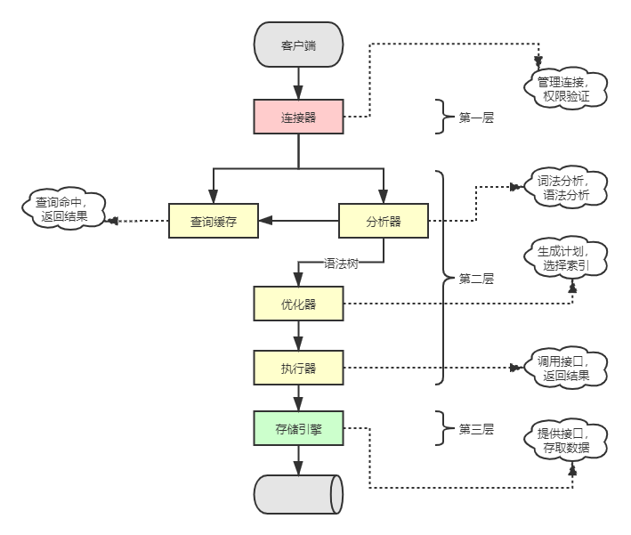
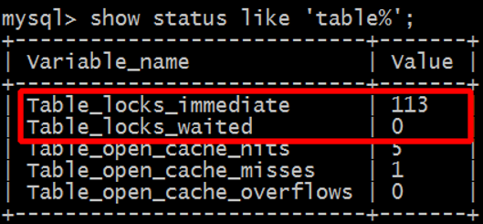
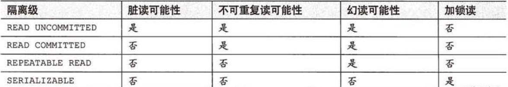

# 第一章 Mysql架构与历史

## 1.Mysql逻辑架构

   

Mysql的逻辑架构可以大致分为三层：

#### 第一层

1. 连接/线程处理：
   - 账号密码认证
   - 证书安全认证
   - 权限认证

#### 第二层

1. 查询缓存（8.0去除）

2. 分析器：核心服务功能

   - 词法分析，形成语法树（解析树）

   - 错误的语法挑选出来

   - 内置函数

   - 跨存储引擎功能：存储过程、触发器、视图等

3. 查询优化器

   - 索引优化：使用最优索引
   - 多表关联：选择大小表关联顺序
   - where优化：从左到右，找过滤力度最大的先执行

4. 执行器

   - 调用存储引擎提供的接口，返回结果

#### 第三层

1. 存储引擎
   - 作用是拿数据，来源：File System、内存
   - 以表为单位，建表的时候可以指定存储引擎
   - 常见存储引擎engine
   
     - InnoDB（default）
       - 速度稍慢
       - 支持事务、行锁
       - count需要扫表
     - MyISAM
       - 高速插入、查询
       - 不支持事务、行锁，并发能力差。不支持外键
       - count有专门的计数器
     - Memory（可用于临时表）
       - 存储于内存，速度最快，但不支持持久化

## 2.并发控制

#### 读写锁

锁根据类型分类

- 共享锁/**读锁**
  - 加**读锁**之后，别人也可以加**读锁**，不能加**写锁**
- 排他锁/**写锁**
  - 加了**写锁**，别人不能加**读锁**、也不能加**写锁**

#### 锁粒度

锁根据粒度分类，可以分为表级锁、行级锁

- 表级锁

  表级锁用得很少，开销小、加锁快、范围广。

  - 添加**读锁**方式：lock table mylock read;

  - 执行``show status like 'table%';``可以查看锁状态

    

    - table_locks_immediate：产生表级锁定的次数；
    - table_locks_waited：出现表级锁定争用而发生等待的次数；

  - 添加**写锁**方式： lock table mylock write; 

- 行级锁（InnoDB）

  行级锁开销大、并发高。由**InnoDB存储引擎实现**。

## 3.事务

#### 四大特性

- 特性类别
  - Atomicity（原子性）：构成事务的的所有操作必须是一个逻辑单元，要么全部执行，要么全部不执行。
  - Consistency（一致性）：数据库在事务执行前后状态都必须是稳定的或者是一致的。 （钱的总数不变）
  - Isolation（隔离性）：事务之间不会相互影响。优化读写性能（读不加锁、读写不冲突）（未执行完事务A，事务B看不到变化）
  - Durability（持久性）：事务执行成功后必须全部写入磁盘。
- 实现方式
  - 隔离性：通过MVVC实现
  - 原子性、一致性、持久性：通过redo log、undo log、Force Log at Commit实现

#### 隔离级别

- 未提交读
  - 事务A的修改，没有提交，对其他事务也是可见的（脏读）
- 提交读/不可重复读
  - 事务A从开始到结束，所做的修改事务B看不见
  - 两次重复查询，得到不同的结果
- 可重复读
  - MySql默认隔离级别
  - 多次读取结果一致，不存在脏读
  - 但存在幻读
- 可串行化
  - 最高隔离级别
  - 读取的每一行都加上锁
  - 导致超时和锁争用问题

#### 死锁

- 两个session相互等待对方释放资源，造成死锁
- 数据库死锁解决方案：死锁检测和死锁超时机制
- InnoDB解决死锁：将持有少数行级排他锁的事务进行回滚

#### 事务日志

数据存到磁盘是随机IO，需要在磁盘多个地方移动磁头。事务日志采用的是追加方式，所以是在小块区域内顺序IO。

## 4.多版本并发控制

#### MVCC概念

- 为了提高效率，数据库不是简单的行级锁。而是实现非阻塞的读操作，写只锁定必要的行。
- 通过版本号，大多数读操作都不用加锁。
- MVCC只在提交读，可重复读 隔离级别下工作

#### InnoDB的MVCC实现原理

- 每行记录隐藏两列：行的创建时间，行的过期/删除时间（其实是系统版本号）。
- 新增一个事务，系统版本号自动递增。
- 事务开始的系统版本号作为事务版本号，用来和查询到的记录版本号比较。

#### InnoDB的MVCC具体操作

- SELECT
  - 找早于当前事务版本的数据行
  - 行的删除版本要么未定义，要么大于当前事务版本
- INSERT
  - 为插入的每一行保存当前系统版本号为行版本号
- DELETE
  - 为删除的每一行保存当前版本号为删除标识
- UPDATE
  - 为插入行保存当前版本号为行版本号，同时为原来行保存当前版本号为删除标识