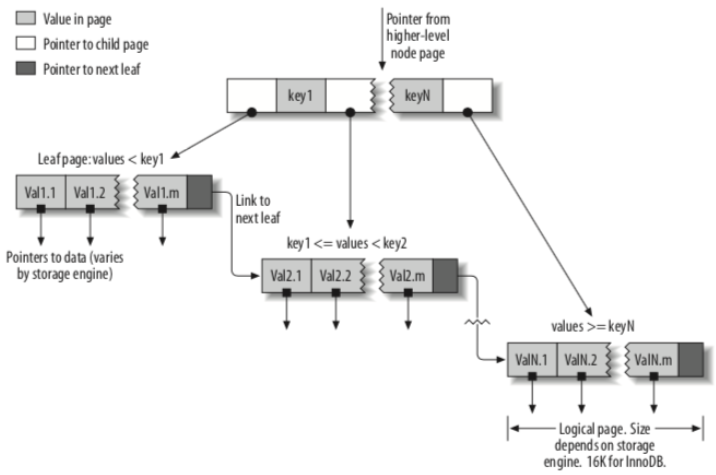
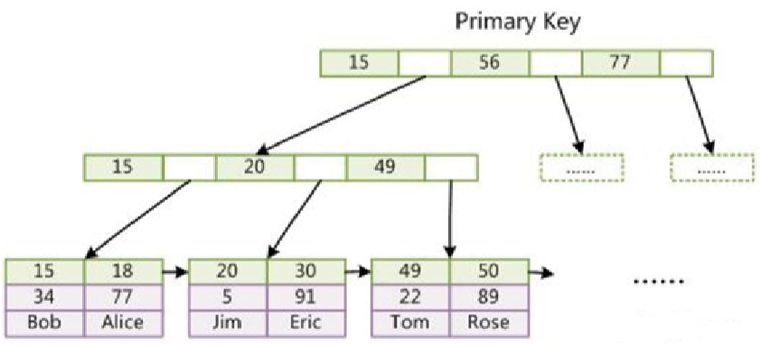

# 创建高性能的索引

## 索引基础

索引特点

- 优点
  - 查询快
  - 自动排序（已有顺序，避免排序建立临时表）
  - 将随机IO变为顺序IO
- 缺点
  - 占空间，建立条件： 10w级别以上
  - 新增修改删除慢

### 索引的类型

#### B-Tree索引

B-Tree高度一般为2-4，高度过多会影响读写次数。    

InnoDB引擎使用的是B+Tree，为B-Tree的变种。B+Tree非叶子节点不存储数据，BTree非叶子节点存储数据。

  

#### 哈希索引

特点

- 只有Memory引擎支持
- 哈希索引只包含哈希值和行指针，不包括字段值；
- 哈希索引无法用于排序；也不支持部分索引列匹配查找；只支持等值比较；

- 当出现哈希冲突时：存储引擎必须遍历链表中所有行指针，逐行进行比较。（冲突越多，代价越大）所以查询条件除了要带哈希值，还要带对应的列值。

使用场景

- 伪哈希：当要建立索引的列内容很长，如url地址。可以使用CRC32对url做哈希，存为url_crc字段。再对url_crc字段建立哈希索引

## 高性能的索引策略

### 索引使用原则

- 全值匹配
  - 组合搜索引全部匹配上
- 最佳左前缀原则
  - 带头索引不能死，中间索引不能断
- 不要在索引上做计算
  - 会导致索引失效
- 范围条件右边的列失效
  - 存储引擎不能使用范围条件右边的条件
- 尽量使用覆盖索引
  - 减少使用select *，非要用加order by
- 索引字段上不要使用不等
  - 索引字段使用（!= 或者 < >）判断时，会导致索引失效而转向全表扫描
- 主键索引字段上不可以判断null
  - 非主键字段索引可以判断null
- 索引字段使用like不以通配符开头
  - like  'a%'相当于范围查询，但不会导致右边条件失效
- 索引字段字符串要加单引号
  -  explain select * from tuser where name=123;
  - 虽然mysql会自动转字符，但索引会失效
- 索引字段不要使用or
  - 使用到or会变成全表扫描

### 聚簇索引

InnoDB使用的是聚集索引

- 主键索引

    

  - 数据在叶子节点直接显示
  - 没有主键 
    - 找唯一字段当主键
    - 会自动生成 伪列 当主键 
  - 不要建联合主键，性能低
  - 主键形式
    - 随机UUID：插入花费时间长，占用空间大。
      - 页分裂：当插入新行的时候，如果插入的是中间位置，页就需要不断地做分裂，并且移动大量的数据。最终数据会有碎片
    - 顺序主键：并发插入的时候会造成明显的争用，导致间隙锁竞争
  - 优点：
    - 根据用户ID来聚集数据，通过读取少量数据页就可以获取某个用户的全部邮件。没有聚簇索引，每封邮件都可能导致一次磁盘IO
    - 由于数据都在同一B-Tree中，获取数据比非聚簇索引要快

- 非主键索引

  - 节点存储的是主键
  - 回表
    - 二级索引找到主键之后，再去主键索引的树里找数据
  - **索引覆盖**

### 非聚簇索引

MyISAM使用的是非聚簇索引，索引和数据分开文件存储

索引文件找到地址，然后根据地址从数据文件找数据位置

### 覆盖索引

利用组合索引，将要查询的信息放在同一棵索引树上，免去了回表操作。

### 压缩索引

- 压缩索引大小，可以让更多的索引放入内存中，极大提高性能。
- MyISAM的压缩方式：用数字代替相同的值，如第一个值perform、第二个值performance，则第二个值被压缩为“7，ance”
- 压缩索引的代价就是某些操作可能更慢

（**索引案例学习**放到下一篇文章）