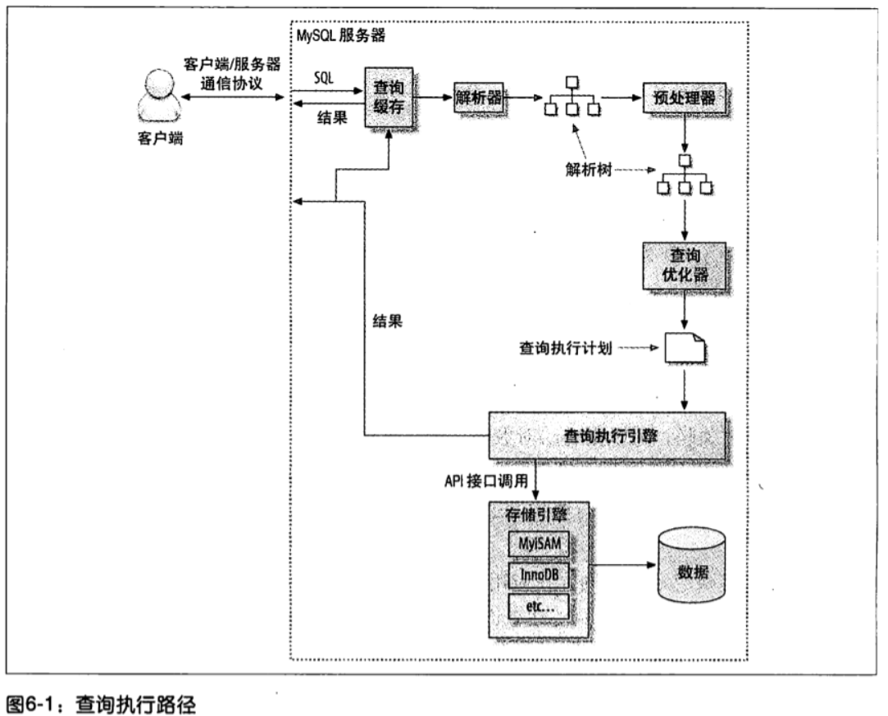

# 查询性能优化

## 优化数据访问

### 1.是否请求了不需要的数据

常见的有以下几种情况：

1. 查询不需要的记录
2. 多表关联时返回全部列
3. 总是取出全部列
4. 重复查询相同的数据

比较简单，不做进一步描述

### 2.是否存在扫描额外的记录

1. 通过“快速上限估算法”激素按响应时间是否是一个合理的值。
2. 筛选条件where从好到坏：
   - 索引中使用WHERE过滤不匹配的记录，存储引擎层完成
   - 使用索引覆盖，直接从索引过滤不需要的记录，无需回表，Mysql服务层完成
   - 数据库返回数据，然后过滤不满足条件的数据。
3. 如果发现查询需要扫描大量的数据，但只返回很少的行，可以尝试一下技巧：
   - 使用索引覆盖扫描，把需要的列都放到索引中
   - 改变表结构，如使用单独的汇总表
   - 重写这个复杂的查询，让优化器能以更优化的方式执行。

### 3.重构查询方式

1. 一个复杂查询分为多个简单查询：根据业务情况，将一个复杂查询拆分为多个简单查询。现网速比较快，而且断开和连接也是很轻量级的。

2. 切分查询：一个大的语句会一次锁住很多数据，拆分为多个小语句可以较小影响Mysql性能。

   ```java
   -- 大查询
   DELETE FROM message WHERE created < DATA_SUB(NOW(), INTERBAL 3 MONTH);
   
   -- 小查询 一次删除一万条
   rows_affected = 0
   do {
       rows_affected = do_query(
           "DELETE FROM message WHERE created < DATA_SUB(NOW(), INTERBAL 3 MONTH) 
           LIMIT 10000"
       ) 
   } while rows_affected > 0
   ```

3. 分解关联查询：一条查询遍多条查询，数据缓存在应用程序中。在变化不大的情况下，可以利用缓存，还可以减少锁的竞争。

### 4.查询执行的基础

执行查询的图如下：

  

1. 服务器先查询缓存，命中则返回结果
2. 服务端进行SQL解析、预处理，优化器生成执行计划
3. Mysql根据执行计划，调用存储引擎API进行查询

#### 1.Mysql 客户端 /服务器通信协议

1. 通信协议：MySQL客户端与服务器之间的通信协议是半双工的，这意味着在任何一个时刻，要么是由服务器向客户端发送数据，要么是由客户端向服务器发送数据，这两个动作不能同时发生。
2. 查询状态：一个MySQL连接，或者一个线程，任何时刻都有一个状态
   - sleep：线程正在等待客户端发送新的请求
   - query：线程正在执行查询或者正在将结果发送给客户端
   - locked：在mysql服务器层，该线程正在等待表锁。在存储引擎级别实现的锁，例如 InnoDB的行锁，并不会体现在线程状态中。
   - analyzing and statistics：线程正在收集存储引擎的统计信息，并生成查询的执行计划
   - copying to tmp table[on disk]：线程正在执行查询，并且将其结果都复制到一个临时表中，这种状态一般是group by 操作 或文件排序操作 或 UNION操作。如果这个状态后面有on disk标记，那表示Mysql 正在将一个内存临时表放到磁盘上
   - sorting result：线程正在对结果集进行排序
   - sending data：线程可能在多个状态之间传送数据 或者在生成结果集 或者在向客户端返回数据。

#### 2. 查询优化处理

1. 语法解析器和预处理：对sql语句进行解析，生成解析树。mysql解析器开始验证关键字是否正确，顺序、语法是否正确
2. 动态优化策略：可以直接对解析树进行分析完成优化，不依赖特别的数值，在第一次优化完成后一直有效，即使使用不同的参数重复查询也不会变化，是一种"编译时优化"。
3. 静态优化策略：与查询上下文有关，对查询的动态优化每次执行时都会重新评估。

## 优化特定类型的查询

### 1.优化COUNT查询

count(*)会忽略所有列，直接统计所有行数，性能比选择某列好。

### 2.优化关联查询

- 当表 A 与表 B 关联时， 只需要在关联顺序的第二张表相应列创建索引即可

- 确保GROUP BY和ORDER BY中的表达式只涉及到一个表中的列，这样才可能使用索引优化

### 3.优化子查询

子查询尽可能使用关联查询代替

### 4.优化GROUP BY和DISTINCT

- 当无法使用索引，GROUP BY使用：临时表或者文件排序来做分组

### 5.优化LIMIT分页

- 尽可能使用索引覆盖，通过INNER JOIN延迟关联其他列

  ```sql
  SELECT a.* FROM 表 1 a, (select id from 表 1 where 条件 LIMIT 100000,20 ) b where a.id=b.id
  ```

- 将LIMIT查询转换为已知位置的查询

### 6.优化UNION查询

除非确实要服务器消除重复行，否则尽可能使用UNION ALL


