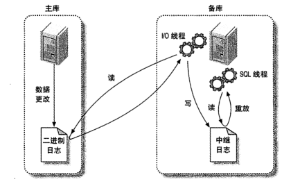

# 复制

## 复制概述

- 复制概述

  - 复制方式

    - 基于行的复制
    - 基于语句的复制（逻辑复制）

  - 实现方法

    - 主库记录二进制日志，备库重放日志实现数据的异步复制

  - 性能

    - 启动二进制文件需要开销
    - 读操作可以读备库，以获得更好的读扩展
    - 写操作却决于写入最慢的备库部分

  - 复制解决的问题

    - 数据分布：不同地理位置分布数据备份
    - 负载均衡：将读操作分布到多个服务器上
    - 备份
    - 高可用性：缩短宕机时间

  - 复制如何工作

      

    - 在主库上把数据更改记录到二进制日志（Binary log）中
    - 备库讲主库上的日志复制到自己的中继日志(Relay log)中
    - 备库读取中继日志中的事件，将其重放到备库数据之上

- 配置复制

  - 在每台服务器上创建复制账号
  - 配置主库和备库
  - 通知备库连接到主库并从主库复制数据