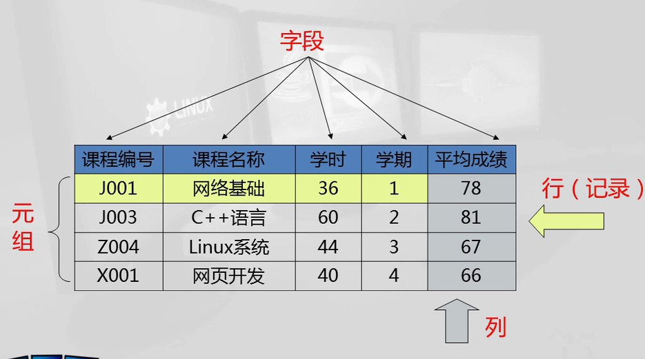
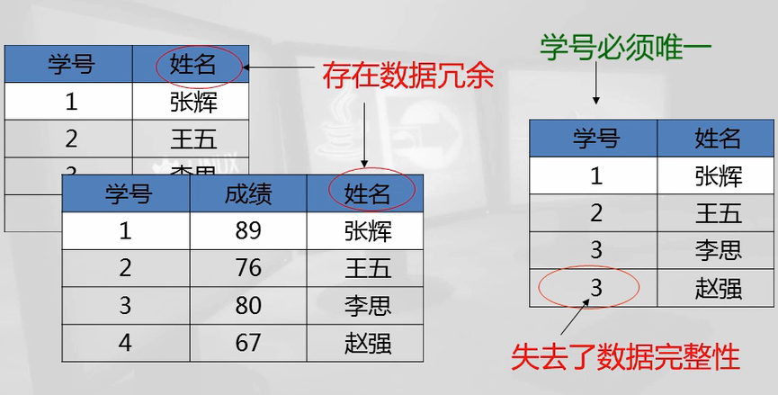

# 数据库的概念  

### 1.表格结构：字段，元组，记录      

   

字段出现问题：失去域完整性（类型，范围，格式 错误）  

### 2.冗余（可以不存在），完整性（数据的正确性）     

### 3.主键&外键    

主键：（区分开每一条数据），主键不能重复，不能为空（为空的话，失去了实体完整性）  

外键：列上的数据来源于其他的表，外键在其他表的列中不存在：失去引用完整性。  

### 4.结构化查询语言  

用于查询，更新，管理关系型数据库系统  

#### 分类：

1. 数据库定义语言（DDL）：create，alter，drop  
2. 数据库操作语言（DML）：insert，delete，update，select  
3. 数据控制语言（DCL）：grant（分配），revoke（回收），deny（拒绝）  

