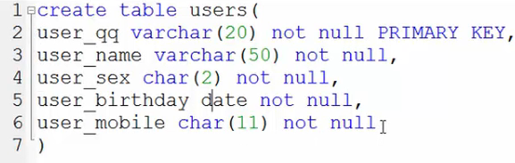
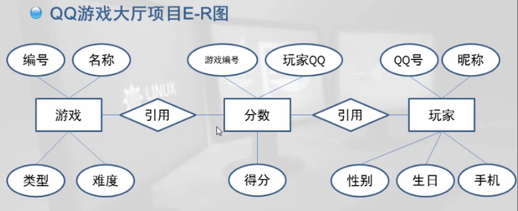

# MySql的基础  

## 1.环境开启

1. 启动mysql服务  
2. 使用navicat来登录mysql  

## 2.基础语法

1. 创建数据库：``create database databaseName;``  
2. 删除数据库：``drop database databaseName;``  
3. 创建数据表：``create table t3(a1 double, a2 float not null)``

## 3.Mysql数据类型

1. 整数，int  
2. 小数，decimal(定点数)，float4，double8  
3. 日期：date精确到日，time精确到秒，datetime时间+秒  
4. 文本：text理论无穷  
5. 二进制：bit    

类型的应用：

  

## 4.数据库设计步骤

#### 1.数据分析    

分析需要什么表，什么字段  

  

#### 2.概要设计    

建立ER图  

   

利用范式进行审核，范式越高冗余越小：  

1. 第一范式：1NF，要求每一列都有原子性（不可再分割）    
2. 第二范式：要求每个表描述一件事情（对象思想）  
3. 第三范式：表中不存在冗余字段   

#### 3.详细设计      

## 5.约束  

保证数据的正确  

#### 1.主键约束    

保证实体的完整性，该列不会出现重复值，空值  

``create table users(user_qq varchar(20) not null primary key)``  

#### 2.外键约束  

保证引用完整性  

引用其他表的列：``references users(user_qq)``,引用users表的user_qq列  

#### 3.检查约束  

保证域的完整性：``gno int not null CHECK(gno>0)``  

#### 4.默认约束  

保证域完整性，给一个缺省值``user_sex char(2) not null default '男'``    

（自增列：保证实体完整性``gno int not null AUTO_NCREMENT``）  

## 6.数据表管理  

### 1.查看数据表  

#### 1.查看数据表的基本结构    

``desc users``  

#### 2.查看表的详细结构  

``show create table table_name``可以查看创建表的sql语句  

### 2.修改数据表  

#### 1.修改表名  

``alert tabel oldName rename to newName``  

#### 2.修改字段名  

``alert table table_name CHANGE old_name new_name new_type``  

#### 3.修改字段数据类型  

``alert table table_name MODIFY col_name new_type``  

  ### 3.字段操作  

#### 1.添加字段    

``alert table table_name ADD new_col_name new_type ``  

#### 2.删除字段  

``alert table table_name DROP col_name``  

### 4.增补约束  

#### 1.增加主键约束  

``alert table table_name ADD CONSTRAINT con_name PRIMARY KEY(col_name)``  

con_name表示约束的名称,形式为：约束_ 表名 _列 ``ck _ games _gno``  

#### 2.添加外键约束  

``alert table table_name ADD CONSTRAINT con_name FOREIGN KEY(col_name) REFERENCES m_table(m_col)``    

#### 3.添加检查约束  

``alert table table_name ADD CONSTRAINT con_name CHECK(col_name>0)``    

#### 4.添加默认值  

``alert table table_name alert col_name set default value ``  

 #### 5.添加自增列  

``alert table table_name MODIFY COLUMN col_name int not null AUTO_INCREMENT primary key``  

### 5.删除数据表

#### 1.删除无关联数据表  

``DROP table table_name,table_second``  

#### 2.删除有关联数据表  

删除有关联的数据表需要先解除关联关系，再删除  

1. 解除关联关系  

``alert table table_name DROP FOREIGN KEY con_name``  

2. 删除表  

``DROP table table_name``  

## 7.数据管理  

### 1.插入数据  

1. 所有列都插入值  

``insert into table_name values ('列1','列2','列3')``  

数值类型的值不需要单引号，into可以省略  

如果该列要用默认值，就写成default  

2. 为特定列插入值  

``insert into table_name (col1,col2,col3) values (v1,v2,v3)``  

3. 一次性插入多条数据  

``insert into table_name (col1,col2,col3) values (v1,v2,v3),(v4,v5,v6)``  

### 2.修改数据  

1. 修改所有的值  

``update table_name set col_name='修改的值'``  

把所有的分数增加100分  

``update table_name set score=score+100``  

2. 修改特定数据  

``update table_name set col_name='修改的值' where col_name='指定的列'``  

### 3.删除数据  

1. 删除指定的信息  

``delete from table_name where col_name='指定的内容'``  

from可以省略  

2. truncate table清空数据  

``truncate table tabel_name``  

truncate不可以指定范围，只能清空  

## 8.数据查询  

(看到_插入数据_，loading）